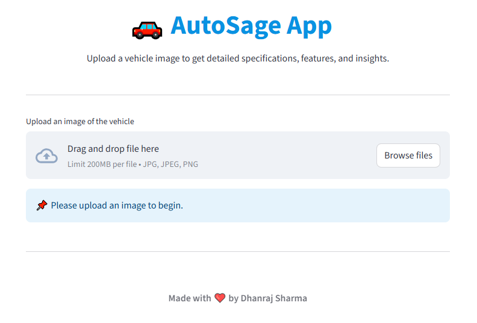
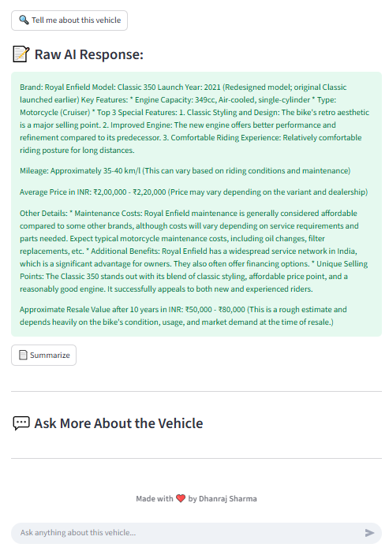
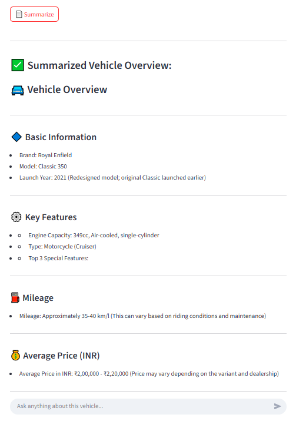
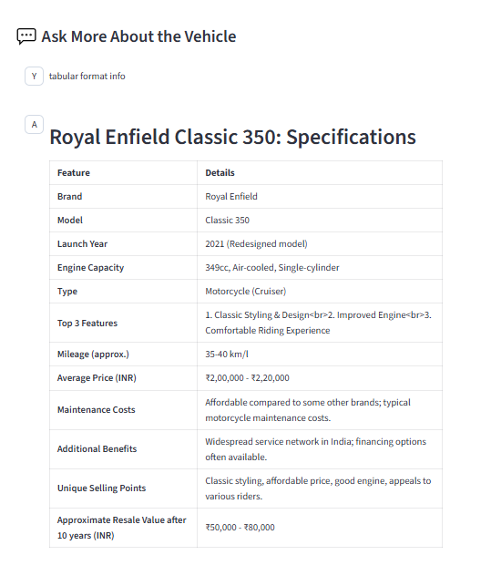

# 🚗 AutoSage – Vehicle Intelligence App

> ***“Upload a vehicle photo, and let AI reveal its specs.”***
> 
> Link : https://autosage-vehicleai-nddimension.streamlit.app/


## 📸 App Preview

<p align="center">
  
</p>

---

## 🎯 Project Overview

**AutoSage** is an intelligent web application that uses **Google Gemini Pro (Generative AI)** to analyze a vehicle image and provide a detailed breakdown of its specifications, features, pricing, and more.

The app is designed for **auto enthusiasts, buyers, and dealerships** looking to get quick, reliable insights just from a photo.

✅ Powered by Google Generative AI
✅ Works with real-world vehicle images
✅ Summarized + detailed vehicle reports
✅ Clean, interactive Streamlit UI


## 📌 Workflow Overview

1. Upload an image of a vehicle

2. Google Gemini Pro analyzes the image based on a custom prompt

3. Model responds with:

    - Brand & model

    - Key features

    - Launch year, price, mileage

    - Maintenance & resale insights

4. Optional: Generate a clean, summarized view and chat with the model


---

## 🧠 How It Works

1. **Image Input** Upload a `.jpg`, `.jpeg`, or `.png` image of a vehicle using the Streamlit UI.<br>


2. **Environment Setup** `.env` file stores your `GOOGLE_API_KEY`, ensuring secure API communication.

3. **Image Processing** Uploaded image is converted to a format Gemini can understand using Pillow and base64 encoding.

4. **Prompt Engineering** A structured prompt guides the Gemini Pro model to return well-organized and rich insights.

4. **Model Output** The response is shown in two views:

    - 💬 **Raw AI output**

    - 📋 **Summarized sleek version** (via “Summarize” button)

---

## 🛠️ Features

| Feature                     | Description                                                              |
| --------------------------- | ------------------------------------------------------------------------ |
| 📤 Upload Vehicle Image     | Upload a vehicle image (jpg, jpeg, png)                                  |
| 🧠 AI Vehicle Analysis      | Uses Gemini Pro to analyze and describe the vehicle                      |
| 🧾 Structured Output        | Information like brand, engine type, features, mileage, and resale value |
| 🧹 Clean Summary Mode       | One-click summarized version with clean bullet-point format              |
| 🖥️ Streamlit Web Interface | Simple and modern frontend experience                                    |
| 🔐 Secure API Access        | Uses `.env` for environment variables (Google API Key)                   |


---

## 📦 Requirements

```txt
streamlit
google-generativeai
python-dotenv
Pillow
```

Install everything using:
```bash
pip install -r requirements.txt
```
---


## ⚙️ Setup & Usage

1️⃣ **Clone the repository**
```bash
git clone https://github.com/yourusername/AutoSage-AI.git
cd AutoSage-AI
```

2️⃣ **Set up virtual environment (recommended)**
```bash
python -m venv venv
source venv/bin/activate  # or venv\Scripts\activate on Windows
```

3️⃣ **Create a** `.env` **file**
```
GOOGLE_API_KEY=your_google_api_key_here
```

4️⃣ **Run the app**
```bash
streamlit run main.py
```

## 🔍 Example Output 

### 📄 Raw AI Output


---
### 📋 Clean Summary


### 📄 ChatAI Output


---

## 🚀 Future Scope
- 📸 Drag-and-drop vehicle image detection

- 📱 Mobile-friendly interface

- 🔊 Text-to-speech vehicle readouts

- 🧠 Improved AI summarization

- 📈 Resale valuation predictor


### ✨ Highlight Tech Stack

- **Python + Streamlit**

- **Google Generative AI (Gemini Pro)**

- **Pillow** for image handling

- **dotenv** for secure key access

---

## 📜 License

Licensed under the [MIT License](LICENSE).


> **AutoSage** — *Visual Intelligence for Automotive Insight*
> ❤️ Built with vision, AI, and horsepower by  **Dhanraj Sharma**.
